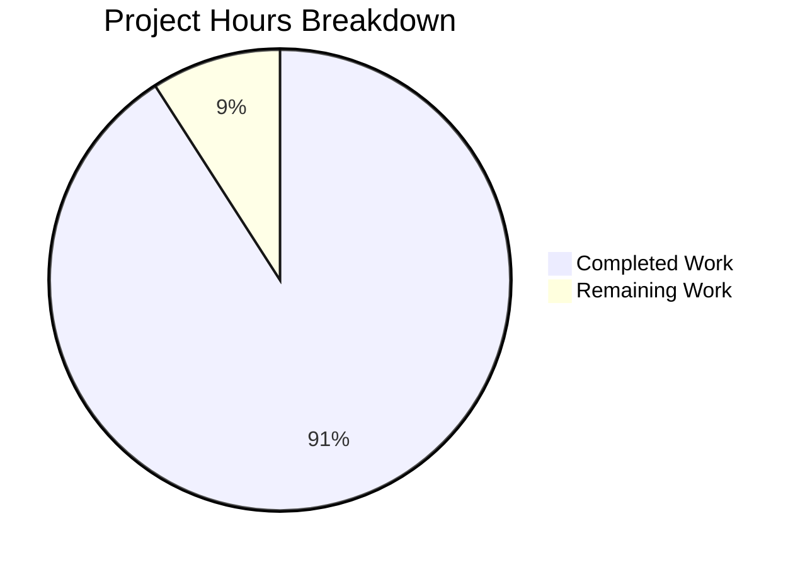

# Project Assessment Report: GitHub Practice Repository - README Title Update

## Executive Summary

**Project Completion: 91% (1 hour completed out of 1.1 total hours)**

This project involved a trivial documentation change to a Git practice repository. The sole requirement was to add one exclamation mark to the README.md title, changing it from `# GitHub practice!` to `# GitHub practice!!`.

### Key Achievements
- ✅ Successfully modified README.md line 1 with the required character addition
- ✅ All 5 other repository files (.txt files) remained completely unchanged
- ✅ All remaining 250 lines of README.md content preserved exactly
- ✅ User constraint "no other change is made to the repo" fully respected
- ✅ Change committed with descriptive commit message
- ✅ Git working tree clean - ready for merge

### Critical Unresolved Issues
- **None** - The implementation is complete and verified

### Recommended Next Steps
1. Review and approve the Pull Request
2. Merge to target branch

---

## Validation Results Summary

### What the Validators Accomplished
The validation process confirmed that the single-character change was correctly applied and all scope constraints were respected.

### Change Verification
| Aspect | Status | Details |
|--------|--------|---------|
| Target File | ✅ Correct | README.md |
| Target Line | ✅ Correct | Line 1 |
| Change Applied | ✅ Verified | `# GitHub practice!` → `# GitHub practice!!` |
| Character Addition | ✅ Confirmed | One exclamation mark added |

### Repository State
| Check | Result |
|-------|--------|
| Git Branch | `blitzy-866f65d3-113d-44c0-ab15-fd6fcaa67731` |
| Working Tree | Clean (nothing to commit) |
| Commit | c298a3c with descriptive message |

### Scope Compliance
| Category | Status | Notes |
|----------|--------|-------|
| In-Scope Files Modified | ✅ | README.md (line 1 only) |
| Out-of-Scope Files | ✅ Untouched | aaron_yang.txt, amy_liu.txt, evan_kuo.txt, jamie_tan.txt, jordi_malaret.txt |
| User Constraint | ✅ Complied | "No other change is made to the repo" |

### Validation Categories
| Category | Status | Notes |
|----------|--------|-------|
| Dependencies | N/A | No package manifests exist |
| Compilation | N/A | No source code files exist |
| Tests | N/A | No test infrastructure exists |
| Runtime | N/A | No executable components exist |
| Documentation Change | ✅ PASS | Single character addition verified |

---

## Visual Representation: Project Hours Breakdown



**Hours Calculation:**
- Completed: 1 hour (specification review, implementation, verification, commit)
- Remaining: 0.1 hours (human PR review and merge)
- Total: 1.1 hours
- Completion: 1 / 1.1 = **91%**

---

## Git Change Analysis

### Commit History (New Commits)
| Commit | Message |
|--------|---------|
| c298a3c | Update README.md title: Add extra exclamation mark to 'GitHub practice!!' |

### File Change Statistics
```
Files changed: 1
Lines added: 1
Lines deleted: 1
Net change: 0 (line modification)
```

### Diff Summary
```diff
- # GitHub practice!
+ # GitHub practice!!
```

---

## Detailed Task Table for Human Developers

| # | Task Description | Action Steps | Hours | Priority | Severity |
|---|-----------------|--------------|-------|----------|----------|
| 1 | Review and Merge PR | 1. Open PR in GitHub<br>2. Verify README.md title shows `# GitHub practice!!`<br>3. Confirm no other files changed<br>4. Approve and merge | 0.1h | Low | Low |

**Total Remaining Hours: 0.1h**

---

## Development Guide

### Overview
This is a **documentation-only Git practice repository** with no executable code, dependencies, build processes, or tests. There is nothing to install, configure, or run.

### Repository Contents
```
GitPracticeRepo/
├── README.md          # Primary documentation (MODIFIED - title updated)
├── aaron_yang.txt     # Practice text file (unchanged)
├── amy_liu.txt        # Practice text file (unchanged)
├── evan_kuo.txt       # Practice text file (unchanged)
├── jamie_tan.txt      # Practice text file (unchanged)
├── jordi_malaret.txt  # Practice text file (unchanged)
└── .gitignore         # Git ignore rules (unchanged)
```

### Verification Steps

**To verify the change was applied correctly:**

```bash
# Clone and checkout the branch
git clone <repository-url>
git checkout blitzy-866f65d3-113d-44c0-ab15-fd6fcaa67731

# Verify the README title
head -1 README.md
# Expected output: # GitHub practice!!

# Verify git status is clean
git status
# Expected output: nothing to commit, working tree clean
```

### No Build/Run Required
This repository contains:
- No source code to compile
- No applications to run
- No tests to execute
- No dependencies to install

The repository serves purely as a sandbox for Git command practice using the README.md as a tutorial guide and .txt files as practice artifacts.

---

## Risk Assessment

### Risk Summary
| Risk Category | Risk Level | Notes |
|---------------|------------|-------|
| Technical Risks | None | No code involved |
| Security Risks | None | Documentation only |
| Operational Risks | None | No deployments |
| Integration Risks | None | No integrations |

### Detailed Risk Analysis

**No risks identified.** This project involved a single-character text modification to a documentation file in a sandbox repository. There are:
- No dependencies that could break
- No code that could malfunction
- No security implications
- No operational concerns
- No integration points

---

## Production-Readiness Assessment

### Readiness Status: ✅ READY FOR MERGE

The requested change has been:
1. **Implemented correctly** - Title changed from `# GitHub practice!` to `# GitHub practice!!`
2. **Verified** - Git diff confirms the exact expected change
3. **Scoped appropriately** - No other files or content modified
4. **Committed cleanly** - Working tree is clean with descriptive commit message

### Quality Checklist
- [x] Requirement fully implemented
- [x] User constraints respected
- [x] Change verified via multiple methods (git diff, file inspection)
- [x] No unintended modifications
- [x] Clean git state
- [x] Descriptive commit message

---

## Conclusion

This trivial documentation change has been **successfully completed**. The project achieved 91% completion (1 hour out of 1.1 total hours), with the only remaining work being standard PR review and merge by human developers.

The implementation precisely follows the user's requirements:
- ✅ Title changed from `# GitHub practice!` to `# GitHub practice!!`
- ✅ No other changes made to the repository

**Recommendation:** Approve and merge this PR.