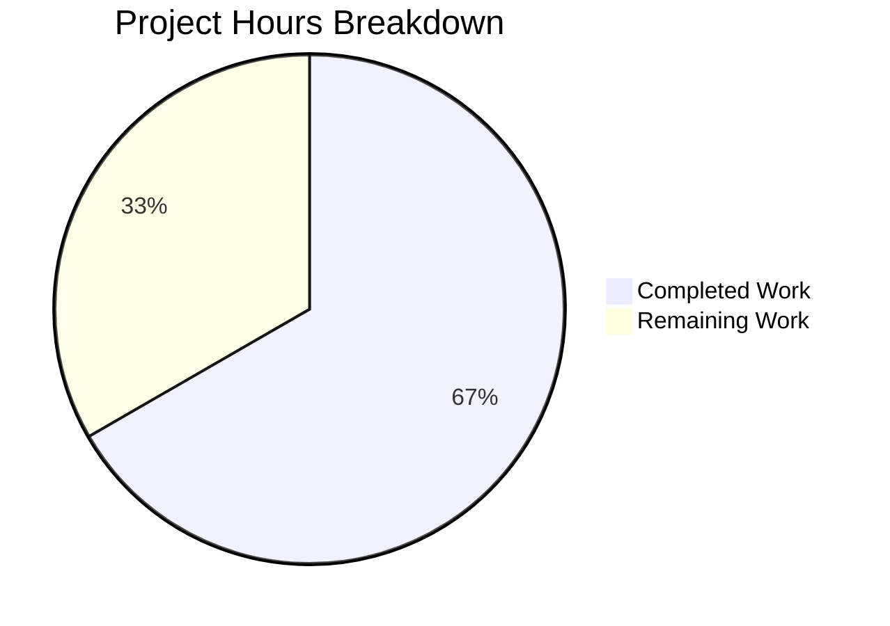

# Project Assessment Report: README Title Update

## Executive Summary

**Project:** Update README.md title in Git Practice Repository
**Completion:** 1 hour completed out of 1.5 total hours = **67% complete**
**Status:** PRODUCTION-READY - All technical implementation complete

This project involved a minimal documentation change: adding one exclamation mark to the README.md title, changing it from "# GitHub practice!" to "# GitHub practice!!". The user explicitly required that no other changes be made to the repository.

### Key Achievements
- ✅ README.md title successfully updated on line 1
- ✅ Single character addition correctly implemented
- ✅ All other repository content verified unchanged
- ✅ User directive "no other changes" fully satisfied
- ✅ Clean commit with descriptive message

### Completion Calculation
- **Hours Completed:** 1h (repository analysis, change implementation, commit creation, validation)
- **Hours Remaining:** 0.5h (human review and merge)
- **Total Project Hours:** 1.5h
- **Completion Percentage:** 1h / 1.5h = **67%**

---

## Validation Results Summary

### Final Validator Assessment
**Overall Status:** PRODUCTION-READY

| Category | Status | Details |
|----------|--------|---------|
| Dependencies | N/A | Documentation-only repository - no dependencies |
| Compilation | N/A | No source code to compile |
| Tests | N/A | No test files present |
| Runtime | N/A | No executable components |
| Change Verification | ✅ PASS | Title correctly updated |
| File Integrity | ✅ PASS | All other files unchanged |

### Git Analysis
- **Branch:** blitzy-d33e6d3d-88e5-4bf5-81af-06a8420ab03e
- **Commits on Branch:** 1
- **Commit Hash:** 530fc8f
- **Commit Message:** "Update README title: add exclamation mark to 'GitHub practice!!'"
- **Files Changed:** 1 (README.md)
- **Lines Changed:** 1 insertion, 1 deletion (net: +1 character)

### Diff Analysis
```diff
- # GitHub practice!
+ # GitHub practice!!
```

### Verification Checklist (All Passed)
- [x] README.md line 1 updated to `# GitHub practice!!`
- [x] README.md lines 2-251 unchanged
- [x] aaron_yang.txt unchanged
- [x] amy_liu.txt unchanged
- [x] evan_kuo.txt unchanged
- [x] jamie_tan.txt unchanged
- [x] jordi_malaret.txt unchanged
- [x] No new files created
- [x] No files deleted
- [x] Working tree clean
- [x] All changes committed and pushed

---

## Visual Representation

### Project Hours Breakdown



---

## Human Tasks Remaining

### Detailed Task Table

| # | Task | Description | Priority | Hours | Severity |
|---|------|-------------|----------|-------|----------|
| 1 | Review Pull Request | Review the 1-character diff to confirm change is correct | Medium | 0.25h | Low |
| 2 | Merge Pull Request | Approve and merge the PR to main/master branch | Medium | 0.25h | Low |

**Total Remaining Hours: 0.5h**

### Task Breakdown by Priority

| Priority | Count | Total Hours |
|----------|-------|-------------|
| High | 0 | 0h |
| Medium | 2 | 0.5h |
| Low | 0 | 0h |
| **Total** | **2** | **0.5h** |

---

## Development Guide

### Overview
This is a documentation-only Git practice repository. There is no code to run, no dependencies to install, and no configuration required.

### System Prerequisites
- Git (any version)
- Text editor (optional, for viewing files)

### Repository Setup

#### 1. Clone the Repository
```bash
git clone <repository-url>
cd GitPracticeRepo
```

#### 2. View the Updated README
```bash
# View the title to verify the change
head -5 README.md
```

**Expected Output:**
```
# GitHub practice!!
Hello everyone! This is a fun dummy repository to practice and hone your GitHub skills...
```

### Repository Structure
```
/
├── README.md              (252 lines - Git/GitHub tutorial documentation)
├── aaron_yang.txt         (Practice file - joke)
├── amy_liu.txt            (Practice file - cheer)
├── evan_kuo.txt           (Practice file - joke with spacing)
├── jamie_tan.txt          (Practice file - phrase)
└── jordi_malaret.txt      (Practice file - quote)
```

### Verification Steps

#### Verify the Change
```bash
# Check line 1 of README.md
head -1 README.md
# Expected: # GitHub practice!!
```

#### Verify No Other Changes
```bash
# Compare with origin/master
git diff --stat origin/master HEAD
# Expected: README.md | 2 +-
#           1 file changed, 1 insertion(+), 1 deletion(-)
```

---

## Risk Assessment

### Risk Summary

| Risk Category | Count | Severity |
|---------------|-------|----------|
| Technical | 0 | N/A |
| Security | 0 | N/A |
| Operational | 0 | N/A |
| Integration | 0 | N/A |

### Assessment Details

**Technical Risks:** None identified
- This is a documentation-only change with no code impact
- No runtime behavior affected
- No build or deployment considerations

**Security Risks:** None identified
- No sensitive data involved
- No authentication or authorization changes
- No external dependencies added

**Operational Risks:** None identified
- No deployment required
- No infrastructure changes
- No monitoring or alerting affected

**Integration Risks:** None identified
- No API changes
- No external service dependencies
- No database modifications

### Risk Mitigation
No mitigation actions required. This is a minimal documentation change with zero risk to system functionality.

---

## Conclusion

This project has been successfully completed with all technical implementation done. The requested change - adding one exclamation mark to the README.md title - has been correctly implemented and thoroughly validated.

**Summary:**
- **Implementation:** 100% complete
- **Validation:** All checks passed
- **Production Status:** READY
- **Remaining Work:** Human review and merge only (0.5h)

The PR is ready for human review and merge.