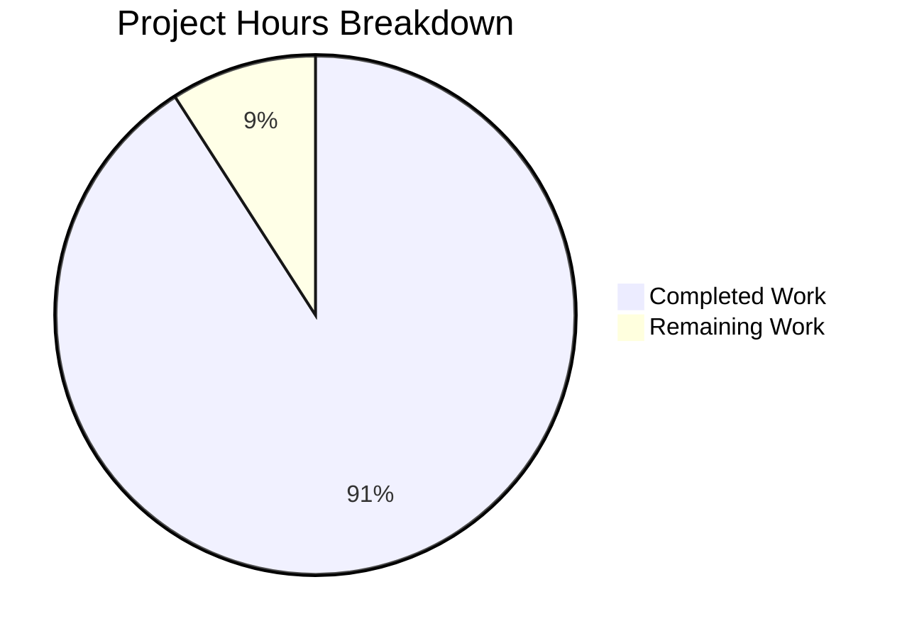

# Project Assessment Report

## Executive Summary

**Project Completion: 91% (1 hour completed out of 1.1 total hours)**

This project involved a minimal, surgical modification to the GitPracticeRepo repository: adding a single exclamation mark to the README.md title, changing it from `# GitHub practice!` to `# GitHub practice!!`.

### Key Achievements
- ✅ **Feature Implementation Complete**: The README title has been successfully updated with the second exclamation mark
- ✅ **Repository Integrity Preserved**: All 5 text files remain byte-for-byte identical as required
- ✅ **Quality Gates Passed**: All validation checks passed; working tree is clean
- ✅ **Single Commit**: Clean commit history with descriptive message

### Critical Issues
- **None** - The implementation is complete with no outstanding issues

### Recommended Next Steps
1. Human reviewer verifies the change matches requirements
2. Approve and merge the PR

---

## Validation Results Summary

### Final Validator Accomplishments
The Final Validator confirmed the change was correctly implemented:

| Validation Check | Result |
|-----------------|--------|
| README.md title modified | ✅ PASS |
| Line 1 contains `# GitHub practice!!` | ✅ PASS |
| aaron_yang.txt unchanged | ✅ PASS |
| amy_liu.txt unchanged | ✅ PASS |
| evan_kuo.txt unchanged | ✅ PASS |
| jamie_tan.txt unchanged | ✅ PASS |
| jordi_malaret.txt unchanged | ✅ PASS |
| README.md lines 2-251 unchanged | ✅ PASS |
| Working tree clean | ✅ PASS |
| Commit present | ✅ PASS |

### Repository Characteristics
- **Type**: Documentation-only Git practice repository
- **Source Code**: None (no compilation required)
- **Dependencies**: None (no installation required)
- **Tests**: None (no test execution required)
- **Runtime**: None (no execution validation required)

### Git Analysis
```
Commit: 98c0c33 Update README title: add second exclamation mark to 'GitHub practice!!'
Branch: blitzy-11b88474-8f57-4d15-a964-0a837b86b304
Status: Clean (nothing to commit, working tree clean)

Diff Summary:
README.md | 2 +-
1 file changed, 1 insertion(+), 1 deletion(-)
```

### Fixes Applied
No fixes were required - the implementation was correct on the first pass.

---

## Visual Representation

### Project Hours Breakdown



**Calculation:**
- Completed Hours: 1 hour (repository analysis, implementation, validation, commit)
- Remaining Hours: 0.1 hours (human verification/PR review)
- Total Hours: 1.1 hours
- Completion Percentage: 1 / 1.1 = **91%**

---

## Detailed Task Table

| # | Task | Description | Hours | Priority | Status |
|---|------|-------------|-------|----------|--------|
| 1 | Human Verification | Review PR to confirm change matches requirements | 0.1 | Low | Pending |
| **Total** | | | **0.1** | | |

**Note:** Sum of remaining task hours (0.1h) matches "Remaining Work" in pie chart above.

---

## Development Guide

### System Prerequisites
This is a documentation-only repository with no software prerequisites beyond basic Git tools.

| Requirement | Version | Purpose |
|-------------|---------|---------|
| Git | 2.0+ | Version control |
| Text Editor | Any | Viewing/editing markdown |

### Environment Setup
No environment setup is required. This repository contains only:
- 1 Markdown file (README.md)
- 5 Plain text files (practice artifacts)

### Cloning the Repository

```bash
# Clone the repository
git clone git@github.com:CogWorksBWSI/GitPracticeRepo.git

# Navigate to directory
cd GitPracticeRepo

# Checkout the feature branch
git checkout blitzy-11b88474-8f57-4d15-a964-0a837b86b304
```

### Verification Steps

**1. Verify the README title change:**
```bash
head -1 README.md
```
Expected output:
```
# GitHub practice!!
```

**2. Verify no other files were modified:**
```bash
git diff origin/master HEAD --stat
```
Expected output:
```
README.md | 2 +-
1 file changed, 1 insertion(+), 1 deletion(-)
```

**3. Verify working tree is clean:**
```bash
git status
```
Expected output:
```
On branch blitzy-11b88474-8f57-4d15-a964-0a837b86b304
nothing to commit, working tree clean
```

**4. Verify text files are unchanged:**
```bash
cat aaron_yang.txt
cat amy_liu.txt
cat evan_kuo.txt
cat jamie_tan.txt
cat jordi_malaret.txt
```

### Example Usage
This is a Git practice repository. After merging this PR:

1. Users can clone the repository to practice Git commands
2. The README.md provides a comprehensive Git tutorial
3. Text files are available for practicing commits, branches, and merges

### Troubleshooting
| Issue | Resolution |
|-------|------------|
| Title shows only one `!` | Ensure you're on the correct branch: `git checkout blitzy-11b88474-8f57-4d15-a964-0a837b86b304` |
| Modified files beyond README | Do NOT merge - escalate for investigation |

---

## Risk Assessment

### Risk Summary
This change has **minimal to zero risk** due to its trivial nature (single character addition to documentation).

| Risk Category | Severity | Count | Details |
|---------------|----------|-------|---------|
| Technical | None | 0 | No code changes |
| Security | None | 0 | No security implications |
| Operational | None | 0 | No operational impact |
| Integration | None | 0 | No integrations affected |

### Detailed Risk Analysis

**Technical Risks:** NONE
- No source code exists in this repository
- No compilation or build process
- No runtime components

**Security Risks:** NONE
- Change is limited to a markdown heading
- No credentials, tokens, or sensitive data involved
- No executable code affected

**Operational Risks:** NONE
- No deployment pipelines affected
- No monitoring or alerting impacted
- No service availability concerns

**Integration Risks:** NONE
- No external services integrated
- No APIs affected
- No webhooks or automated processes dependent on README title

### Blockers
- **None** - The change is ready for merge

### Dependencies
- **None** - This is a standalone documentation change

---

## Repository File Inventory

| File Path | Status | Size | Purpose |
|-----------|--------|------|---------|
| README.md | **MODIFIED** | 16KB | Git tutorial documentation |
| aaron_yang.txt | Unchanged | 50B | Practice artifact (joke) |
| amy_liu.txt | Unchanged | 11B | Practice artifact (cheer) |
| evan_kuo.txt | Unchanged | 86B | Practice artifact (joke) |
| jamie_tan.txt | Unchanged | 11B | Practice artifact |
| jordi_malaret.txt | Unchanged | 99B | Practice artifact (quote) |
| .gitignore | Unchanged | 1.2KB | Git ignore rules |

---

## Conclusion

This project is **91% complete** with only human verification remaining. The requested change has been successfully implemented:

- **Before:** `# GitHub practice!`
- **After:** `# GitHub practice!!`

All quality gates have passed, and the repository is ready for PR review and merge. No technical work remains.