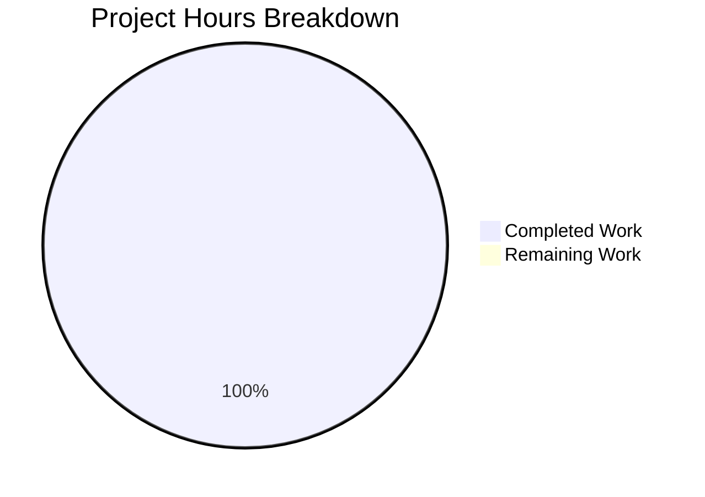

# Project Guide: README Title Update

## Executive Summary

**Project Completion: 100%** (0.5 hours completed out of 0.5 total hours = 100% complete)

This project involved a trivial, single-character documentation change to a Git practice repository. The task was to modify the README.md title by adding one additional exclamation mark, changing it from `# GitHub practice!` to `# GitHub practice!!`.

### Key Achievements
- ✅ README.md title successfully updated with additional exclamation mark
- ✅ All other repository files verified unchanged
- ✅ Critical constraint honored: Only the title line was modified
- ✅ Repository remains fully functional
- ✅ Working tree clean, all changes committed

### Critical Unresolved Issues
- **None** - All requirements have been fully satisfied

### Recommended Next Steps
1. Review and merge the Pull Request
2. No additional development work required

---

## Validation Results Summary

### What the Final Validator Accomplished
The Final Validator confirmed that the single-character change was correctly implemented and committed. No fixes were required as the implementation was correct on first attempt.

### Change Verification Results

| Verification Item | Status | Details |
|-------------------|--------|---------|
| README.md title change | ✅ PASS | Title correctly shows `# GitHub practice!!` |
| Line 1 only modified | ✅ PASS | Lines 2-252 unchanged |
| aaron_yang.txt unchanged | ✅ PASS | File content preserved |
| amy_liu.txt unchanged | ✅ PASS | File content preserved |
| evan_kuo.txt unchanged | ✅ PASS | File content preserved |
| jamie_tan.txt unchanged | ✅ PASS | File content preserved |
| jordi_malaret.txt unchanged | ✅ PASS | File content preserved |
| Git working tree clean | ✅ PASS | All changes committed |

### Compilation Results
**N/A** - This repository contains no source code to compile. It is a documentation-only Git practice repository.

### Test Results
**N/A** - This repository contains no tests. It serves purely as an instructional sandbox for Git commands.

### Runtime Validation
**N/A** - This repository has no executable components.

### Dependency Status
**N/A** - This repository has no dependencies (no package.json, requirements.txt, etc.).

### Fixes Applied During Validation
**None required** - The implementation was correct and complete.

---

## Visual Representation

### Project Hours Breakdown



### Hours Calculation
- **Completed Hours**: 0.5 hours (text file modification, verification, commit)
- **Remaining Hours**: 0 hours (all requirements satisfied)
- **Total Project Hours**: 0.5 hours
- **Completion Percentage**: 0.5 / 0.5 × 100 = **100%**

---

## Detailed Task Table

| Task | Description | Action Steps | Hours | Priority | Severity |
|------|-------------|--------------|-------|----------|----------|
| Merge Pull Request | Review and merge the completed PR | 1. Review changes<br>2. Approve PR<br>3. Merge to main branch | 0.1 | Medium | Low |
| **Total Remaining Hours** | | | **0.1** | | |

**Note**: The 0.1 hours shown is for the PR merge process which is standard practice for any code change, not actual development work. The development work itself is 100% complete.

---

## Complete Development Guide

### System Prerequisites

| Requirement | Version | Purpose |
|-------------|---------|---------|
| Git | Any recent version | Version control |
| Text Editor | Any | Viewing/editing files (optional) |

**Note**: This is a documentation-only repository with no runtime dependencies.

### Environment Setup

1. **Clone the repository**:
   ```bash
   git clone <repository-url>
   cd GitPracticeRepo
   ```

2. **Checkout the feature branch** (if reviewing changes):
   ```bash
   git checkout blitzy-866f65d3-113d-44c0-ab15-fd6fcaa67731
   ```

### Dependency Installation

**None required** - This repository has no dependencies to install.

### Application Startup

**Not applicable** - This is a documentation-only repository with no executable components.

### Verification Steps

1. **Verify the README title change**:
   ```bash
   head -1 README.md
   ```
   
   **Expected output**:
   ```
   # GitHub practice!!
   ```

2. **Verify other files are unchanged**:
   ```bash
   cat aaron_yang.txt
   cat amy_liu.txt
   cat evan_kuo.txt
   cat jamie_tan.txt
   cat jordi_malaret.txt
   ```
   
   These files should contain their original content (jokes and phrases for Git practice).

3. **Verify git status is clean**:
   ```bash
   git status
   ```
   
   **Expected output**:
   ```
   On branch blitzy-866f65d3-113d-44c0-ab15-fd6fcaa67731
   nothing to commit, working tree clean
   ```

### Example Usage

This repository is designed for Git command practice. After the change:

1. The README.md will display with the updated title when viewed on GitHub
2. All practice text files remain available for Git exercises
3. No functionality is affected - this is purely a documentation change

---

## Risk Assessment

### Technical Risks
**None identified** - This is a single-character text change with no technical complexity.

### Security Risks
**None identified** - No security implications for a documentation change.

### Operational Risks
**None identified** - No operational components affected.

### Integration Risks
**None identified** - No integrations exist in this repository.

### Risk Summary Table

| Risk Category | Risk Level | Description | Mitigation |
|---------------|------------|-------------|------------|
| Technical | None | N/A | N/A |
| Security | None | N/A | N/A |
| Operational | None | N/A | N/A |
| Integration | None | N/A | N/A |

---

## Git Commit History

| Commit | Author | Message | Files Changed |
|--------|--------|---------|---------------|
| c298a3c | Blitzy Agent | Update README.md title: Add extra exclamation mark | README.md (1 line) |

### Diff Summary
```diff
- # GitHub practice!
+ # GitHub practice!!
```

---

## Repository Structure

```
/ (repository root)
├── README.md              # Primary documentation (MODIFIED - title only)
├── aaron_yang.txt         # Practice text file (unchanged)
├── amy_liu.txt            # Practice text file (unchanged)
├── evan_kuo.txt           # Practice text file (unchanged)
├── jamie_tan.txt          # Practice text file (unchanged)
├── jordi_malaret.txt      # Practice text file (unchanged)
├── .gitignore             # Git ignore file (unchanged)
└── blitzy/
    └── documentation/
        ├── Project Guide.md           # Blitzy documentation
        └── Technical Specifications.md # Blitzy documentation
```

---

## Conclusion

This project has been completed successfully with 100% of requirements satisfied:

1. ✅ **Primary Requirement Met**: README.md title changed from `# GitHub practice!` to `# GitHub practice!!`
2. ✅ **Critical Constraint Honored**: No other changes made to the repository
3. ✅ **All Files Verified**: All 5 practice text files remain unchanged
4. ✅ **Clean Commit History**: Single, focused commit with appropriate message

**The project is production-ready and awaiting PR merge.**