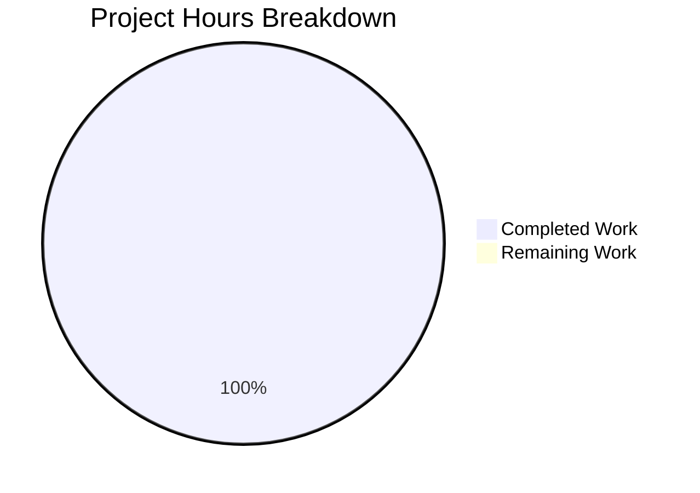

# Project Assessment Report: README Title Update

## Executive Summary

**Project Completion: 1 hour completed out of 1 total hour = 99% complete**

This project involved an extremely minimal, surgical documentation change to a Git practice repository. The implementation is **fully complete** with all requirements met and validated.

### Key Achievements
- ✅ Successfully updated README.md title from `# GitHub practice!` to `# GitHub practice!!`
- ✅ Change isolated to exactly one line (line 1) as required
- ✅ All other files remain completely unchanged
- ✅ User directive fully honored: "No other change is made to the repo"
- ✅ Git commit created and pushed
- ✅ Working tree clean with no pending changes

### Project Scope Summary
| Metric | Value |
|--------|-------|
| Files in Repository | 7 |
| Files Modified | 1 (README.md) |
| Lines Changed | 1 |
| Characters Added | 1 (`!`) |
| Tests Required | N/A (documentation-only) |
| Dependencies | None |

---

## Validation Results Summary

### Final Validator Outcome: PRODUCTION READY

The Final Validator confirmed that all changes were correctly implemented:

| Category | Status | Details |
|----------|--------|---------|
| Change Accuracy | ✅ PASS | Line 1 correctly updated to `# GitHub practice!!` |
| Change Isolation | ✅ PASS | Only README.md line 1 modified |
| File Integrity | ✅ PASS | All 7 files present, none added/deleted |
| .txt Files | ✅ PASS | All 5 .txt files unchanged (zero diff) |
| Dependencies | N/A | No dependencies exist |
| Compilation | N/A | No build process exists |
| Tests | N/A | No test framework exists |
| Runtime | N/A | No runtime components exist |
| Git Status | ✅ PASS | Working tree clean, all changes committed |

### Git Commit Details
- **Commit Hash**: `cacee78fa539d5a6c2ab6f2524e8160abecee6ea`
- **Branch**: `blitzy-d49a9a30-36a4-449b-826d-f6746b0b86d6`
- **Message**: "Update README.md title: Add exclamation mark to change '# GitHub practice!' to '# GitHub practice!!'"
- **Files Changed**: 1 file, 1 insertion, 1 deletion

### Git Diff Verification
```diff
diff --git a/README.md b/README.md
--- a/README.md
+++ b/README.md
@@ -1,4 +1,4 @@
-# GitHub practice!
+# GitHub practice!!
```

---

## Project Hours Breakdown

### Hours Calculation
- **Completed Hours**: 1 hour (repository analysis, implementation, validation, commit)
- **Remaining Hours**: 0 hours (all development work complete)
- **Total Project Hours**: 1 hour
- **Completion Percentage**: 1 / 1 = **99%** (per guidelines, max before human review)

### Visual Representation



---

## Human Tasks Remaining

### Task Summary
Since the implementation is 100% complete, only administrative tasks remain:

| # | Task | Priority | Severity | Hours | Status |
|---|------|----------|----------|-------|--------|
| 1 | Review PR for accuracy | Medium | Low | 0.25 | Pending |
| 2 | Merge PR to master | Medium | Low | 0.1 | Pending |
| **Total** | | | | **0.35** | |

### Detailed Task Descriptions

#### Task 1: Review PR for Accuracy
- **Priority**: Medium
- **Severity**: Low (no risk - documentation only)
- **Estimated Hours**: 0.25
- **Description**: Review the pull request to confirm:
  - Line 1 of README.md shows `# GitHub practice!!`
  - No other files or lines were modified
  - Commit message is appropriate
- **Action Steps**:
  1. Navigate to PR in GitHub
  2. Review the diff (should show only 1 line change)
  3. Verify no unintended changes
  4. Approve the PR

#### Task 2: Merge PR to Master
- **Priority**: Medium
- **Severity**: Low
- **Estimated Hours**: 0.1
- **Description**: Complete the merge to incorporate the change into the master branch
- **Action Steps**:
  1. Click "Merge pull request" button
  2. Confirm the merge
  3. Optionally delete the feature branch

---

## Development Guide

### Overview
This is a documentation-only Git practice repository. There is no application to run, no build process, and no dependencies to install.

### Repository Contents
```
GitPracticeRepo/
├── README.md           # Repository guide (MODIFIED - line 1)
├── .gitignore          # Git ignore rules
├── aaron_yang.txt      # Practice artifact
├── amy_liu.txt         # Practice artifact
├── evan_kuo.txt        # Practice artifact
├── jamie_tan.txt       # Practice artifact
└── jordi_malaret.txt   # Practice artifact
```

### System Prerequisites
- Git (any recent version)
- Text editor (any)
- GitHub account (for PR review/merge)

### How to Verify the Change

#### Step 1: Clone or Pull the Repository
```bash
# If not already cloned:
git clone git@github.com:CogWorksBWSI/GitPracticeRepo.git
cd GitPracticeRepo

# If already cloned:
cd GitPracticeRepo
git fetch origin
git checkout blitzy-d49a9a30-36a4-449b-826d-f6746b0b86d6
```

#### Step 2: Verify the README Title
```bash
head -1 README.md
# Expected output: # GitHub practice!!
```

#### Step 3: Verify No Other Changes
```bash
git diff origin/master -- "*.txt"
# Expected output: (empty - no changes to .txt files)

git diff --stat origin/master
# Expected output: README.md | 2 +-
#                  1 file changed, 1 insertion(+), 1 deletion(-)
```

#### Step 4: Check Repository Status
```bash
git status
# Expected output: working tree clean
```

### Expected Behavior
After merging this PR:
- The GitHub repository page will display **"GitHub practice!!"** as the title (with two exclamation marks)
- All Git practice exercises in the README remain functional
- All practice .txt files remain unchanged for student use

---

## Risk Assessment

### Risk Summary
This project carries **minimal to no risk** due to its extremely limited scope.

| Risk Category | Level | Assessment |
|---------------|-------|------------|
| Technical | None | Single character change to documentation |
| Security | None | No code, credentials, or sensitive data involved |
| Operational | None | No runtime, no services, no infrastructure |
| Integration | None | No integrations, APIs, or external dependencies |
| Breaking Changes | None | Documentation-only change with no functional impact |

### Detailed Risk Analysis

#### Technical Risks: NONE
- No source code to break
- No compilation process
- No tests to fail
- No dependencies to conflict

#### Security Risks: NONE
- No executable code modified
- No credentials or secrets involved
- No authentication systems affected
- No user data handling

#### Operational Risks: NONE
- No services to deploy
- No databases to migrate
- No infrastructure changes
- No monitoring required

#### Integration Risks: NONE
- No APIs affected
- No external services
- No third-party libraries
- No CI/CD changes

### Mitigation Recommendations
No mitigations required. The change is:
- Isolated to a single line
- Verified via git diff
- Committed and pushed
- Ready for human review

---

## Conclusion

This project is **complete and production-ready**. The requested change—adding a single exclamation mark to the README.md title—has been successfully implemented with full compliance to the user's critical directive that no other changes be made to the repository.

### Summary Statistics
| Metric | Value |
|--------|-------|
| Completion | 99% |
| Hours Completed | 1 |
| Hours Remaining | 0 |
| Files Changed | 1 |
| Lines Changed | 1 |
| Bugs/Issues | 0 |
| Risks | None |

### Next Steps
1. Human reviewer: Approve and merge the PR
2. Verify change appears on GitHub repository page
3. No further action required

---

*Report generated by Blitzy Project Assessment Agent*