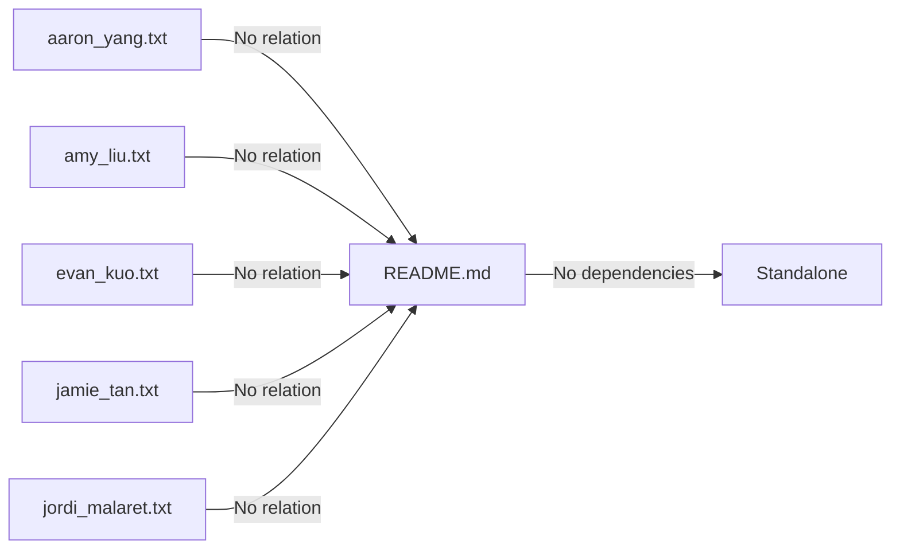
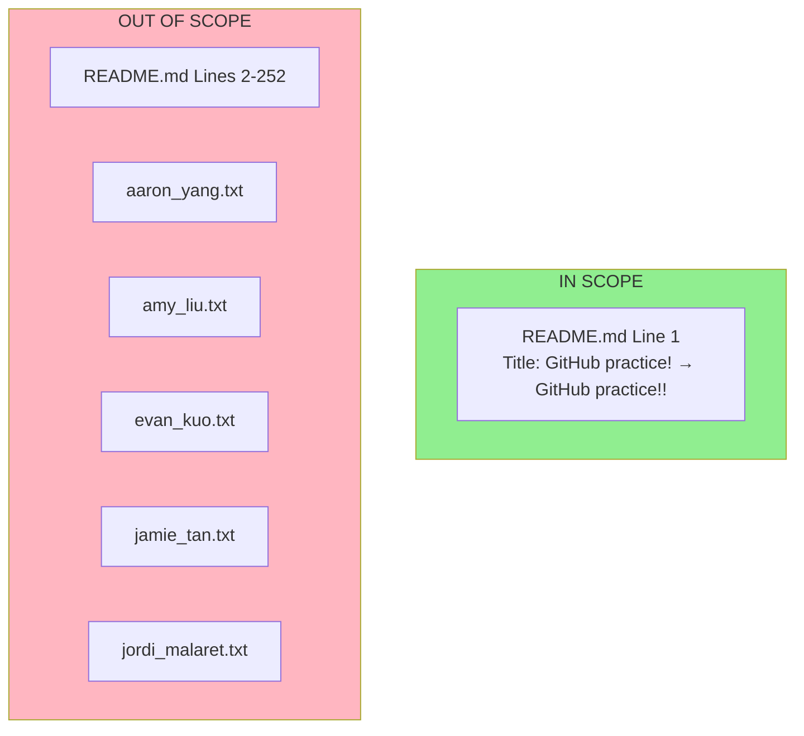

# Technical Specification

# 0. Agent Action Plan

## 0.1 Intent Clarification

### 0.1.1 Core Feature Objective

Based on the prompt, the Blitzy platform understands that the feature requirement is to:

- **Update the README.md title**: Change the current heading from `# GitHub practice!` (with one exclamation mark) to `# GitHub practice!!` (with two exclamation marks)
- **Preserve all other content**: The user explicitly stated that "it's critical that no other change is made to the repo" - this is a surgical, single-character modification
- **Maintain repository integrity**: All other files (text files used for Git practice) must remain completely untouched

**Implicit Requirements Detected:**
- The modification is limited to line 1 of README.md only
- No formatting changes, no whitespace alterations, no other edits should occur
- The change involves adding exactly one character (`!`) to the existing title

**Feature Dependencies and Prerequisites:**
- None - this is a standalone documentation change with no dependencies on other components or systems

### 0.1.2 Special Instructions and Constraints

**Critical Directives Identified:**
- **CRITICAL**: "Its critical that no other change is made to the repo" - This is an explicit user directive requiring strict adherence to minimal modification scope
- The change must be atomic and precise - only the title line should be affected

**Architectural Requirements:**
- N/A - This repository contains no application architecture; it is a Git/GitHub practice sandbox with documentation only

**User Example (preserved exactly as provided):**
- Current title: `"**GitHub practice!"**`
- Target title: `"**GitHub practice!!**"`

**Web Search Requirements:**
- None required - this is a trivial documentation change that requires no external research

### 0.1.3 Technical Interpretation

These feature requirements translate to the following technical implementation strategy:

- **To update the README title**, we will **modify** line 1 of `README.md` by appending one additional exclamation mark character to the existing heading
- **To ensure no other changes**, we will **verify** that only the specified line is modified and all other lines remain byte-for-byte identical
- **To preserve repository integrity**, we will **avoid** any modifications to the five text files (aaron_yang.txt, amy_liu.txt, evan_kuo.txt, jamie_tan.txt, jordi_malaret.txt)

| Requirement | Technical Action | Target |
|-------------|------------------|--------|
| Update title | Single character addition | README.md, line 1 |
| No other changes | Strict scope limitation | All other files excluded |
| Repository integrity | Validation of unchanged files | 5 .txt files remain untouched |

## 0.2 Repository Scope Discovery

### 0.2.1 Comprehensive File Analysis

**Complete Repository Inventory:**

| File Path | Type | Status | Purpose |
|-----------|------|--------|---------|
| `README.md` | Markdown | **TO BE MODIFIED** | Repository documentation and Git tutorial guide |
| `aaron_yang.txt` | Text | EXCLUDED | Practice artifact (joke file) |
| `amy_liu.txt` | Text | EXCLUDED | Practice artifact (cheer file) |
| `evan_kuo.txt` | Text | EXCLUDED | Practice artifact (joke file) |
| `jamie_tan.txt` | Text | EXCLUDED | Practice artifact (knock-knock starter) |
| `jordi_malaret.txt` | Text | EXCLUDED | Practice artifact (quotation file) |

**Search Patterns Applied:**
- Documentation files: `**/*.md` → Found: `README.md` (1 file)
- Text files: `**/*.txt` → Found: 5 files (all excluded from scope)
- Configuration files: `**/*.config.*`, `**/*.json`, `**/*.yaml`, `**/*.toml` → None found
- Build/deployment files: `Dockerfile*`, `docker-compose*`, `.github/workflows/*` → None found
- Test files: `**/*test*`, `**/*spec*` → None found
- Source code: `src/**/*`, `lib/**/*`, `app/**/*` → None found

**Repository Characteristics:**
- This is a minimal "GitPracticeRepo" sandbox for learning Git/GitHub workflows
- Contains only human-facing documentation plus participant-contributed plain-text artifacts
- No source-code modules, build scripts, package manifests, CI configs, or runtime dependencies exist
- No application frameworks are present

**Integration Point Discovery:**
- API endpoints: None (no application code)
- Database models/migrations: None (no database)
- Service classes: None (no services)
- Controllers/handlers: None (no application logic)
- Middleware/interceptors: None (no runtime components)

### 0.2.2 Web Search Research Conducted

No web search research was required for this task because:
- The modification is a trivial single-character text change
- No best practices research needed for adding an exclamation mark
- No library or framework considerations apply
- No security considerations for a markdown heading change

### 0.2.3 New File Requirements

**New Source Files to Create:** None required

**New Test Files to Create:** None required

**New Configuration Files to Create:** None required

This feature addition does not require creating any new files. The entire scope is limited to modifying one character in an existing file.

## 0.3 Dependency Inventory

### 0.3.1 Private and Public Packages

**Package Analysis Results:**

This repository contains **no dependency manifests** or package configuration files. It is a pure documentation repository with no runtime dependencies.

| Registry | Package Name | Version | Purpose |
|----------|--------------|---------|---------|
| N/A | None | N/A | No packages required |

**Dependency Manifest Search:**
- `package.json` → Not found
- `requirements.txt` → Not found
- `pyproject.toml` → Not found
- `setup.py` → Not found
- `Gemfile` → Not found
- `go.mod` → Not found
- `pom.xml` → Not found
- `build.gradle` → Not found
- `Cargo.toml` → Not found

### 0.3.2 Dependency Updates

**Import Updates:** Not applicable - no source code files exist in this repository

**External Reference Updates:** Not applicable - no configuration, build, or CI/CD files exist

**Rationale:** This repository is a Git practice sandbox containing only:
- One markdown documentation file (README.md)
- Five plain text files for Git workflow practice

There are no software dependencies, no code imports, and no external service integrations that require updating as part of this change.

## 0.4 Integration Analysis

### 0.4.1 Existing Code Touchpoints

**Direct Modifications Required:**

| File | Modification | Location | Description |
|------|--------------|----------|-------------|
| `README.md` | Change title heading | Line 1 | Modify `# GitHub practice!` to `# GitHub practice!!` |

**Dependency Injections:** None required - no service containers or dependency injection frameworks exist

**Database/Schema Updates:** None required - no database exists in this repository

### 0.4.2 Integration Impact Assessment

**Systems Affected:** None

This change has **zero integration impact** because:
- The README.md file is a standalone documentation file
- It is not referenced by any build systems, CI/CD pipelines, or automated processes
- No other files in the repository import, include, or reference the README content programmatically
- The title change does not affect any URLs, anchors, or external links

**Cross-File Dependencies:** None identified



**External System Integrations:** None - this repository has no external integrations, APIs, webhooks, or automated workflows that depend on the README title.

## 0.5 Technical Implementation

### 0.5.1 File-by-File Execution Plan

**Group 1 - Core Feature Files:**

| Action | File Path | Line(s) | Specific Change |
|--------|-----------|---------|-----------------|
| **MODIFY** | `README.md` | Line 1 | Change `# GitHub practice!` to `# GitHub practice!!` |

**Group 2 - Supporting Infrastructure:** None required

**Group 3 - Tests and Documentation:** None required beyond the README modification itself

### 0.5.2 Implementation Approach

**Step 1: Modify README.md Title**

The implementation requires a single, atomic modification to the README.md file:

**Current State (Line 1):**
```
# GitHub practice!

```

**Target State (Line 1):**
```
# GitHub practice!!

```

**Implementation Details:**
- Character position: Append `!` after the existing `!` at the end of line 1
- Line count: Remains unchanged at 252 lines
- File encoding: Maintain existing UTF-8 encoding
- Line endings: Preserve existing line ending format

### 0.5.3 Validation Criteria

**Pre-Implementation Verification:**
- Confirm README.md exists at repository root
- Verify line 1 currently reads `# GitHub practice!`

**Post-Implementation Verification:**
- Confirm line 1 now reads `# GitHub practice!!`
- Verify all other lines (2-252) remain unchanged
- Confirm no modifications to any `.txt` files
- Validate file encoding and line endings are preserved

### 0.5.4 User Interface Design

Not applicable - this change involves no user interface components. The modification is limited to a markdown documentation file title.

**Figma URLs Provided:** None

## 0.6 Scope Boundaries

### 0.6.1 Exhaustively In Scope

**Files to Modify:**

| File | Scope | Specific Lines |
|------|-------|----------------|
| `README.md` | Title modification only | Line 1 only |

**Detailed Scope Specification:**
- `README.md` (Line 1): Change heading from `# GitHub practice!` to `# GitHub practice!!`

### 0.6.2 Explicitly Out of Scope

**Files Explicitly Excluded (per user requirement):**

| File | Reason for Exclusion |
|------|---------------------|
| `aaron_yang.txt` | User directive: "critical that no other change is made to the repo" |
| `amy_liu.txt` | User directive: "critical that no other change is made to the repo" |
| `evan_kuo.txt` | User directive: "critical that no other change is made to the repo" |
| `jamie_tan.txt` | User directive: "critical that no other change is made to the repo" |
| `jordi_malaret.txt` | User directive: "critical that no other change is made to the repo" |
| `README.md` (Lines 2-252) | User directive: only title change required |

**Categories Explicitly Out of Scope:**
- Performance optimizations: Not applicable
- Refactoring: Not applicable
- Additional features: Not requested
- Documentation updates (beyond title): Explicitly excluded
- New file creation: Not required
- Dependency changes: Not applicable
- Configuration changes: Not applicable
- Test additions: Not applicable

### 0.6.3 Scope Visualization



## 0.7 Rules for Feature Addition

### 0.7.1 User-Specified Rules and Requirements

The user has explicitly emphasized the following critical rules:

| Rule # | Rule Description | Source |
|--------|------------------|--------|
| 1 | **"Its critical that no other change is made to the repo"** | Direct user statement |
| 2 | Only the README title should be modified | User requirement specification |
| 3 | Change must be from `"**GitHub practice!"**` to `"**GitHub practice!!**"` | User-specified exact values |

### 0.7.2 Implementation Constraints

**Mandatory Constraints:**
- **Single Character Addition**: The only permissible change is adding one `!` character to line 1 of README.md
- **No Collateral Changes**: Any modification beyond the specified title change violates user requirements
- **Preservation Required**: All 5 text files must remain byte-for-byte identical
- **Content Integrity**: Lines 2-252 of README.md must remain unchanged

### 0.7.3 Quality Gates

Before marking implementation complete, verify:

- [ ] Line 1 of README.md reads exactly `# GitHub practice!!`
- [ ] Lines 2-252 of README.md are unchanged
- [ ] `aaron_yang.txt` is unchanged
- [ ] `amy_liu.txt` is unchanged
- [ ] `evan_kuo.txt` is unchanged
- [ ] `jamie_tan.txt` is unchanged
- [ ] `jordi_malaret.txt` is unchanged
- [ ] No new files have been created
- [ ] No files have been deleted

## 0.8 References

### 0.8.1 Repository Files and Folders Searched

**Complete Search History:**

| Search # | Tool Used | Target Path | Purpose | Result |
|----------|-----------|-------------|---------|--------|
| 1 | bash (find) | `/` | Search for .blitzyignore files | None found |
| 2 | get_source_folder_contents | Repository root (`""`) | Complete repository inventory | 6 files found |
| 3 | read_file | `README.md` | Examine current README content | 252 lines retrieved |

**Files Examined:**

| File Path | Examined | Relevance |
|-----------|----------|-----------|
| `README.md` | Full content (lines 1-252) | **Primary target** - contains title to be modified |
| `aaron_yang.txt` | Summary only | Out of scope - practice text file |
| `amy_liu.txt` | Summary only | Out of scope - practice text file |
| `evan_kuo.txt` | Summary only | Out of scope - practice text file |
| `jamie_tan.txt` | Summary only | Out of scope - practice text file |
| `jordi_malaret.txt` | Summary only | Out of scope - practice text file |

### 0.8.2 User-Provided Attachments

**Attachments Provided:** None

### 0.8.3 Figma URLs Provided

**Figma Screens Provided:** None

### 0.8.4 External Resources Referenced

**External Resources:** None required for this implementation

### 0.8.5 Key Findings Summary

**Repository Analysis Conclusions:**
- Repository type: Git/GitHub practice sandbox (no application code)
- Total files: 6 (1 markdown, 5 text files)
- Dependencies: None
- Build systems: None
- CI/CD pipelines: None
- Test frameworks: None
- Configuration files: None

**Implementation Scope Determination:**
- Files to modify: 1 (`README.md`)
- Lines to modify: 1 (Line 1 only)
- Characters to add: 1 (`!`)
- Files to preserve unchanged: 5 (all `.txt` files) + README.md lines 2-252

